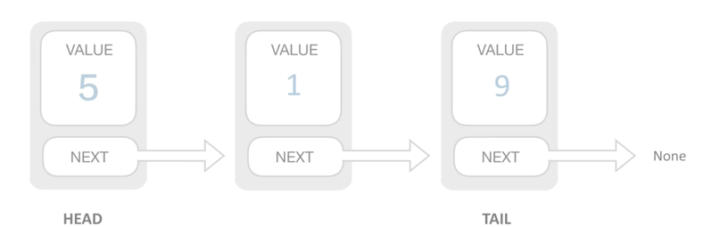
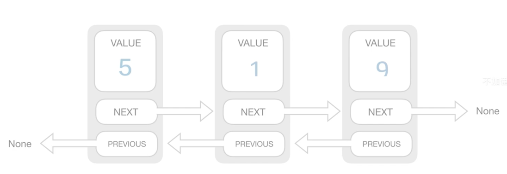

# 序章

## About Interview

- Phone Interview
    - collabedit.com
    - coderpad.io

## Block Link

- Link 链表 --> Block --> Binary Tree 二叉树

## Talk a book 《Outliers》

- Chunk it up 切碎知识点
- Deliberate practicing 刻意练习
- Feedback 反馈
    - 主动  `Leetcode`
    - 被动  `code view`

## Common data structures

- Sorting
- Link list
- list
- spanning tree
- tree
- graph
- stack
- hashing

##

- Clarification
- Possible solutions
    - compare(time/spec)
    - optimal
- Coding 写代码
- Test cases 测试案例

# 目录

- Data Structure
    - Array
    - Stack/Queue
    - PriorityQueue(heap)
    - LinkedList(single/double)
    - Tree/Binary Tree
    - Binary Search Tree
    - Hash Table
    - Disjoint Set
    - Trie
    - bloomFilter
    - LRU Cache
- Algorithm
    - General Coding
    - In-order/Pre-order/Post-order traversal
    - Greedy
    - TRecursion/Backtrace
    - Breadth-first search
    - Depth-first search
    - Divide and Conquer
    - Dynamic Programming
    - Binary Search
    - Graph

# Start

## 时间复杂度

- 递归
  ```python
  def fib(n):
    if n == 0 or n == 1:
      return n
    return fib(n - 1) + fib(n - 2)
  ```
  > O(2^n)

## 空间复杂度


## Master Theorem 主定理
- Binary search
  - T(n) = T(N / 2) + O(1)
  - O(log n)
- Binary tree traversal
  - T(n) = 2 * T(N / 2) + O(1)
  - O(n)
- Optimal sorted matrix search  排序查找
  - T(n) = 2 * T(N / 2) + O(log n)
  - O(n)
- Merge sort  排序
  - T(n) = 2 * T(N / 2) + O(n)
  - O(n * log n)

# 数组&链表
## Array  数组
- 内存里一串连续的区存储
  - O(1)
- Inserting
  - 插入操作需要挪动后面所有的值
  - O(n)
- Deleting
  - O(n)
## Linked List
- 插入和删除操作多有优势
- 不知道元素个数
### 单链表

- Finding
  - O(n)
- Inserting 2次操作  
  - O(1)
- Deleting
  - O(1)
### 双链表

